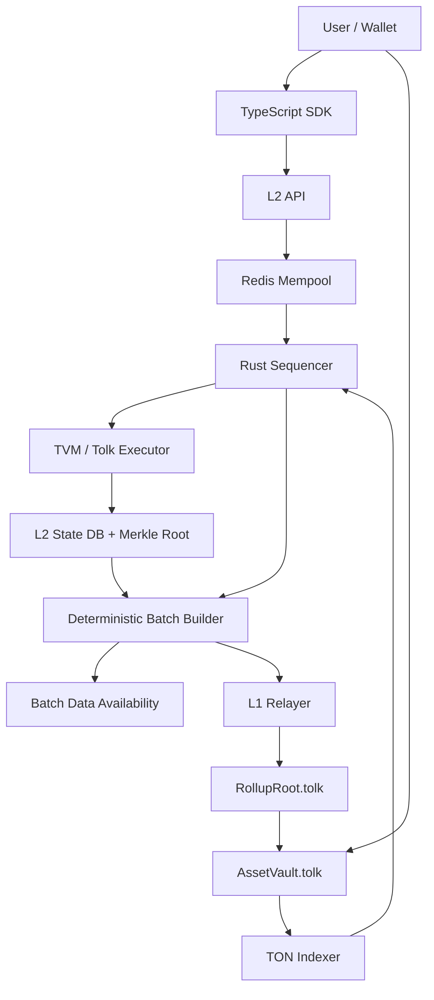

# TON L2 Rollup MVP

This repository implements the first scaffold of an optimistic Layer 2 anchored to TON.
It is intentionally TON/TVM-oriented: L1 settlement contracts are written in Tolk, and
the off-chain system models TON-style async execution, canonical hashes, L1 deposits,
state-root commitments, and finalized withdrawal proofs.

## How Entropis L2 Works



## Layout

- `crates/l2-core`: Rust L2 state model, Merkle hashing, sequencer, mempool, executor boundary, and tests.
- `crates/l2-node`: Axum HTTP/WebSocket node exposing the planned L2 API.
- `contracts/l1`: Tolk contract sources for `RollupRoot` and `AssetVault`.
- `sdk`: TypeScript client helpers for transaction building, hashing, TON cells, and API calls.
- `docs`: Architecture and local operation notes.

## Current MVP Boundaries

- The Rust executor applies deposits, transfers, and withdrawals deterministically.
- `l2-node` is configured for the Entropis testnet profile (`entropis-testnet`, ENT gas token) through local environment variables.
- Postgres storage persists blocks, transactions, deposits, withdrawals, L1 cursors, and ENT faucet grants.
- Redis backs public mempool replay checks, nonce locks, and sequencer leader locks.
- ENT is L2-native first with 9 decimals and an admin-only testnet faucet; no L1 Jetton is deployed in this phase.
- `CallContract` is rejected with `tvm_adapter_not_implemented`; the trait boundary is in place for a TON TVM adapter.
- Tolk contracts are source scaffolds following current Tolk message/storage/getter patterns.
- Acton is required for contract build/tests, but current Windows release assets do not include a native Windows binary.

## Rust Validation

```powershell
cargo test
Copy-Item .env.example .env.local
cargo run -p l2-node
```

The node listens on `127.0.0.1:8080` by default. Put real testnet secrets only in
`.env.local`; it is ignored by git.
