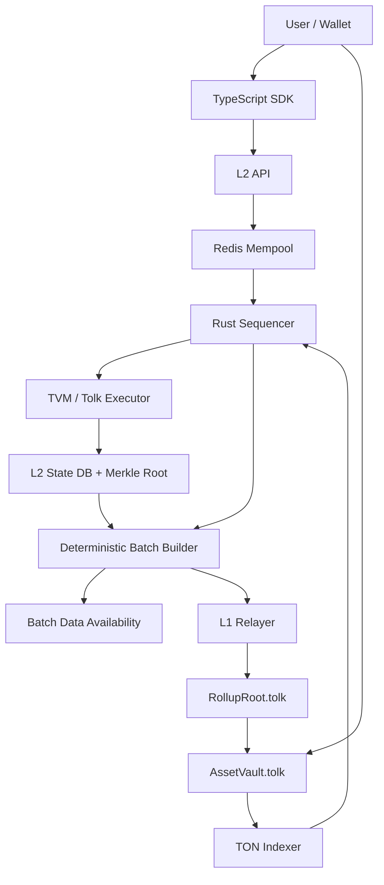

# TON L2 Rollup MVP

This repository implements the first scaffold of an optimistic Layer 2 anchored to TON.
It is intentionally TON/TVM-oriented: L1 settlement contracts are written in Tolk, and
the off-chain system models TON-style async execution, canonical hashes, L1 deposits,
state-root commitments, and finalized withdrawal proofs.

## How Entropis L2 Works



## Layout

- `crates/l2-core`: Rust L2 state model, Merkle hashing, sequencer, mempool, executor boundary, and tests.
- `crates/l2-node`: Axum HTTP/WebSocket node exposing the planned L2 API.
- `contracts/l1`: Tolk contract sources for `RollupRoot` and `AssetVault`.
- `deployments/testnet/entropis.json`: public testnet L1 registry with root/vault metadata.
- `sdk`: TypeScript client helpers for transaction building, hashing, TON cells, and API calls.
- `docs`: Architecture, local operation notes, CI quality gates, and operator runbooks.

## Testnet Deployment Registry

Public TON testnet contract metadata lives in `deployments/testnet/entropis.json`.
The registry starts in `draft` state until a verified testnet deployment exists.
It may contain only public addresses, hashes, timestamps, versions, and getter
expectations. Runtime endpoints, API keys, signer tokens, wallet material, and
database/Redis URLs stay in `.env.local` or the operator environment.

Validate registry edits before committing:

```powershell
python scripts/ci/validate_deployment_registry.py deployments/testnet/entropis.json
```

## Current MVP Boundaries

- The Rust executor applies deposits, transfers, and withdrawals deterministically.
- `l2-node` is configured for the Entropis testnet profile (`entropis-testnet`, ENT gas token) through local environment variables.
- Postgres storage persists blocks, transactions, deposits, withdrawals, L1 cursors, and ENT faucet grants.
- Redis backs public mempool replay checks, nonce locks, and sequencer leader locks.
- Batch DA payloads are canonical consensus bytes stored through a Postgres-backed DA abstraction and verified before any L1 batch commit.
- Operators get split `/healthz` and `/readyz` checks plus admin-only metrics and failure visibility endpoints.
- ENT is L2-native first with 9 decimals and an admin-only testnet faucet; no L1 Jetton is deployed in this phase.
- `CallContract` validates a single-root TON BoC body and goes through a mockable TVM adapter boundary. The default adapter is noop/fail-closed and returns `tvm_adapter_not_implemented` until the real TON TVM emulator is wired.
- Fraud proofs are documented as a roadmap only; the current MVP remains trusted-sequencer optimistic until L1 challenge verification is implemented.
- Tolk contracts are source scaffolds following current Tolk message/storage/getter patterns.
- Acton is required for contract build/tests, but current Windows release assets do not include a native Windows binary.

## TVM Adapter Boundary

`l2-core` exposes `TvmExecutionAdapter` for future isolated TON TVM execution.
The boundary receives caller, contract hash, input BoC bytes, gas limit, explicit
block context, and the current contract account state. It returns a contract-local
state delta, emitted internal messages, gas used, and applied/rejected status.

The executor remains a pure deterministic state transition layer: it does not read
environment variables, does not make network calls, validates malformed BoCs before
execution, caps emitted internal messages and message body sizes, and rejects
adapter output that tries to mutate a contract other than the target.

## Rust Validation

```powershell
cargo test
Copy-Item .env.example .env.local
cargo run -p l2-node
```

The node listens on `127.0.0.1:8080` by default. Put real testnet secrets only in
`.env.local`; it is ignored by git.

## Public Testnet SDK Demo

The SDK includes a composable public demo CLI for account, faucet, transfer,
deposit payload, withdrawal proof, and L1 claim payload flows. It is testnet-only:
the CLI refuses registries whose `tonNetwork` is not `testnet` or whose `chainId`
is not `entropis-testnet`.

Configure the demo from environment variables instead of editing JSON by hand:

```powershell
cd sdk
npm ci
$env:ENTROPIS_API_BASE_URL = "http://127.0.0.1:8080"
$env:ENTROPIS_REGISTRY_PATH = "..\deployments\testnet\entropis.json"
```

Generate a throwaway L2 account. By default this prints only the account id and
public key:

```powershell
npm run demo -- generate-account
```

For a disposable local test key only, add `--show-secret` and set the returned
`secret_key_hex` as `ENTROPIS_SECRET_KEY_HEX`. Do not use that key outside
testnet demos.

```powershell
$env:ENTROPIS_SECRET_KEY_HEX = "<throwaway-secret-key-hex>"
```

Request the admin-only ENT faucet. The admin token is read from the environment
and is never printed:

```powershell
$env:ENTROPIS_ADMIN_TOKEN = "<testnet-admin-token>"
npm run demo -- faucet --account-id <account-id>
```

Submit a signed L2 transfer. If `--nonce` is omitted, the CLI reads the account
nonce from `/v1/account/:id`; add `--dry-run` to print the signed transaction
without submitting it.

```powershell
npm run demo -- transfer --to <recipient-account-id> --amount 1000000000 --nonce 0
npm run demo -- transfer --to <recipient-account-id> --amount 1000000000 --nonce 0 --dry-run
```

Build a TON deposit payload for wallet submission. The vault address comes from
the active testnet registry deployment, or can be supplied explicitly before the
registry has deployed addresses:

```powershell
npm run demo -- deposit-payload --l2-recipient <account-id> --amount 1000000000 --query-id 1
npm run demo -- deposit-payload --vault-address <testnet-vault-address> --l2-recipient <account-id> --amount 1000000000
```

Create a withdrawal, fetch its proof, and build a RollupRoot claim payload:

```powershell
npm run demo -- withdraw --l1-recipient <ton-testnet-address> --amount 1000000000 --nonce 1
npm run demo -- get-proof --withdrawal-id <withdrawal-id>
npm run demo -- claim-withdrawal --withdrawal-id <withdrawal-id> --amount 150000000
```

Demo output is JSON and includes fields such as `account_id`, `tx_hash`,
`block_height`, `proof_id`, `withdrawal_id`, and `tonconnect_message.payload`.
Payload commands are dry-run by design: they produce wallet-ready messages but
do not broadcast L1 transactions.

## Quality Gates

GitHub Actions runs security and artifact guards, Rust format/tests, SDK
typecheck, Postgres/Redis service readiness, and optional Acton contract checks.
See `docs/ci-quality-gates.md` for the local pre-commit commands and CI job
layout.
