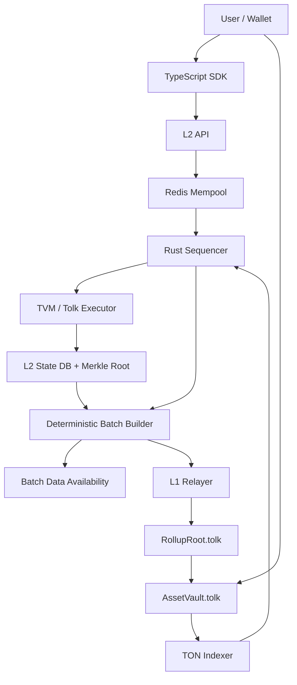

# TON L2 Rollup MVP

This repository implements the first scaffold of an optimistic Layer 2 anchored to TON.
It is intentionally TON/TVM-oriented: L1 settlement contracts are written in Tolk, and
the off-chain system models TON-style async execution, canonical hashes, L1 deposits,
state-root commitments, and finalized withdrawal proofs.

## How Entropis L2 Works



## Layout

- `crates/l2-core`: Rust L2 state model, Merkle hashing, sequencer, mempool, executor boundary, and tests.
- `crates/l2-node`: Axum HTTP/WebSocket node exposing the planned L2 API.
- `contracts/l1`: Tolk contract sources for `RollupRoot` and `AssetVault`.
- `examples/l2-wallet-v5`: Tolk EnWallet V5 R1-compatible smart-contract wallet.
- `examples/l2-counter`: sample L2 Tolk counter contract.
- `sdk`: TypeScript client helpers for transaction building, hashing, TON cells, and API calls.
- `docs`: Architecture, local operation notes, CI quality gates, operator runbooks,
  and the public testnet launch checklist.

## L2 Token And Address Format

ENT is the L2-native gas token. The consensus gas coin asset id is `0`
(`L2_NATIVE_GAS_ASSET`), and execution fees are charged as
`gas_used * max_gas_price` in ENT base units.

L2 accounts and sample contracts are still 32-byte account ids internally, but
public tooling supports two address formats:

- raw technical: `8:<64 lowercase hex chars>`
- user-friendly: `EX...` deterministic base64url, 48 chars total; after `EX`,
  valid characters are `A-Z`, `a-z`, `0-9`, `-`, and `_`

The SDK accepts raw, user-friendly, and legacy bare 64-hex account ids for local
compatibility. New demos print both `8:` and `EX` forms.

## Quick Start For Local Testing

Use these commands from the repository root. They keep the run local and
testnet-only.

1. Prepare local config:

```powershell
Copy-Item .env.example .env.local
notepad .env.local
```

Set at least:

```text
DATABASE_URL=<local-postgres-connection-url>
REDIS_URL=<local-redis-connection-url>
L2_ADMIN_TOKEN=<local-random-token>
TON_NETWORK=testnet
L1_DEPOSIT_INDEXER_ENABLED=false
L1_BATCH_RELAYER_ENABLED=false
```

2. Run the normal checks:

```powershell
cargo fmt --all -- --check
cargo test --workspace
Set-Location sdk
npm ci
npm run typecheck
npm run test:vectors
Set-Location ..
```

If WSL Acton is installed, also run contract checks:

```powershell
wsl bash scripts/ci/acton_contract_checks.sh
```

3. Start the L2 node:

```powershell
cargo run -p l2-node
```

The node listens on `http://127.0.0.1:8080` by default.

4. Check the process and dependencies:

```powershell
curl.exe http://127.0.0.1:8080/healthz
curl.exe http://127.0.0.1:8080/readyz
curl.exe http://127.0.0.1:8080/v1/mempool/metrics
```

5. Build the SDK and use the public example against the local node:

```powershell
Set-Location sdk
npm ci
npm run build
```

The source example is `sdk/examples/testnet-happy-path.ts`. It generates a
throwaway local keypair, optionally requests the admin faucet, submits a transfer,
and prints TON Connect deposit/claim messages. Run it only after the node is live:

```powershell
$env:ENTROPIS_ADMIN_TOKEN = "<same-value-as-L2_ADMIN_TOKEN>"
$env:ENTROPIS_API_URL = "http://127.0.0.1:8080"
npm exec --yes tsx examples/testnet-happy-path.ts
Set-Location ..
```

Run the sample L2 contract flow:

```powershell
Set-Location sdk
npm run build
$env:ENTROPIS_ADMIN_TOKEN = "<same-value-as-L2_ADMIN_TOKEN>"
$env:ENTROPIS_API_URL = "http://127.0.0.1:8080"
npm exec --yes node examples/l2-counter-sample.mjs
Set-Location ..
```

Create an EnWallet V5 R1 init transaction from a 24-word seed-backed keypair in
SDK code:

```ts
import {
  createEnWalletMnemonic,
  enwalletKeyPairFromMnemonic,
  enwalletV5InitialState,
  signEnWalletV5InitTransaction,
} from "@ton-l2-rollup/sdk";

const mnemonic = await createEnWalletMnemonic();
const keyPair = await enwalletKeyPairFromMnemonic(mnemonic);
const wallet = enwalletV5InitialState({ publicKey: keyPair.publicKey });

const initTx = signEnWalletV5InitTransaction({
  chainId: "entropis-testnet",
  from: wallet.owner_account_id,
  nonce: 0,
  gasLimit: 50,
  maxGasPrice: "1",
  keyPair,
});
```

CLI-style demo after `npm run build`:

```powershell
Set-Location sdk
npm run build
npm exec --yes node examples/enwallet-v5-init.mjs
Set-Location ..
```

`wallet.wallet_account_id` is the smart-contract wallet address and can be shown
as `EX...` through `l2UserFriendlyAddress`. The account may receive deposits
before initialization; the first `DeployContract` init transaction installs the
W5 code/data and preserves any prefunded balance. Explorer account responses
mark the interface as `org.ton.wallet.v5.r1` / `Wallet Signed External V5 R1`,
and wallet init transactions are marked with `operation: "wallet_init"`.

Deploy code compiled from any Tolk source when you already have the initial data
cell BoC:

```powershell
Set-Location sdk
npm run build
$env:ENTROPIS_TOLK_SOURCE = "..\examples\l2-counter\counter.tolk"
$env:ENTROPIS_DATA_BOC_BASE64 = "<initial-data-cell-boc-base64>"
npm exec --yes node examples/acton-tolk-deploy.mjs
Set-Location ..
```

For actual arbitrary Tolk execution through tonlib TVM, build the node with:

```powershell
cargo run -p l2-node --features tonlib-tvm --bin l2-node
```

For live TON testnet deposit, commit, finalization, and withdrawal rehearsal,
follow `docs/testnet-launch-runbook.md` after the testnet registry, signer, and
funded wallets are available. Do not use mainnet endpoints for this prototype.

## Current MVP Boundaries

- The Rust executor applies deposits, transfers, withdrawals, cell-backed contract deploys, and bounded contract calls deterministically.
- `l2-node` is configured for the Entropis testnet profile (`entropis-testnet`, ENT gas token) through local environment variables.
- Postgres storage persists blocks, transactions, deposits, withdrawals, L1 cursors, and ENT faucet grants.
- Redis backs public mempool replay checks, nonce locks, and sequencer leader locks.
- Batch DA payloads are canonical consensus bytes stored in Postgres and optionally published to a filesystem public gateway, then hash-verified before any L1 batch commit.
- The off-chain observer prototype can replay supplied RollupRoot-style commitments from DA bytes and report missing DA, corrupt DA, receipt, or root divergence.
- Operators get split `/healthz` and `/readyz` checks plus admin-only metrics and failure visibility endpoints.
- ENT is L2-native first with 9 decimals and an admin-only testnet faucet; no L1 Jetton is deployed in this phase.
- `DeployContract` stores real code/data BoC cells in L2 account state and commits their TON cell hashes into the state root. It can initialize an uninitialized prefunded account, matching the TON wallet pattern where an address exists before the first deploy/init transaction. `CallContract` validates a single-root TON BoC body and goes through a mockable TVM adapter boundary. The default adapter executes the sample counter prototype; `--features tonlib-tvm` enables the tonlib TVM backend for arbitrary Tolk code/data cells.
- EnWallet V5 R1 is included as a Tolk smart-contract wallet derived from the TON Wallet V5 interface. The SDK supports 24-word mnemonic key derivation, W5 init-state construction, signed init transactions, and W5 signed body builders.
- Fraud proofs are documented as a roadmap only; the current MVP remains trusted-sequencer optimistic until L1 challenge verification is implemented.
- Tolk contracts are source scaffolds following current Tolk message/storage/getter patterns.
- Acton is required for contract build/tests, but current Windows release assets do not include a native Windows binary.

## TVM Adapter Boundary

`l2-core` exposes `TvmExecutionAdapter` for isolated TON TVM execution.
The boundary receives caller, contract hash, input BoC bytes, gas limit, explicit
block context, and the current contract account state. It returns a contract-local
state delta, emitted internal messages, gas used, and applied/rejected status.

The default adapter is intentionally bounded to the sample counter code cell. It
exists to keep local development lightweight. Build `l2-node` with
`--features tonlib-tvm` to route contract calls through tonlib's TVM emulator
using the code/data BoC stored by `DeployContract`.

The executor remains a pure deterministic state transition layer: it does not read
environment variables, does not make network calls, validates malformed BoCs before
execution, caps emitted internal messages and message body sizes, and rejects
adapter output that tries to mutate a contract other than the target.

## Rust Validation

```powershell
cargo test
Copy-Item .env.example .env.local
cargo run -p l2-node
```

The node listens on `127.0.0.1:8080` by default. Put real testnet secrets only in
`.env.local`; it is ignored by git.

## Quality Gates

GitHub Actions runs security and artifact guards, Rust format/tests, SDK
typecheck, Postgres/Redis service readiness, and optional Acton contract checks.
See `docs/ci-quality-gates.md` for the local pre-commit commands and CI job
layout.

For the public TON testnet prototype launch sequence, see
`docs/testnet-launch-runbook.md`.
