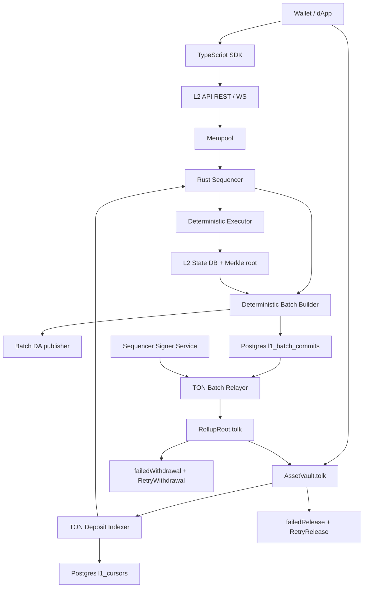

# Architecture

## Trust Model

This is an optimistic MVP. The sequencer commits batch roots to TON, and withdrawals
are claimable only after the challenge window. Fraud proofs are not implemented yet,
so production deployment must treat the sequencer as trusted until the fraud-proof
path or a ZK validity proof is added.

The fraud/challenge roadmap is documented in `docs/challenge-roadmap.md`. The
target model introduces observer/challenger nodes, DA challenges, invalid
transition challenges, challenge bonds, and forced inclusion without changing the
current bridge behavior until the L1 verifier is implemented.

## Hashing

The MVP uses SHA-256 over domain-separated v1 consensus bytes. JSON is allowed for
API and storage presentation, but not for transaction hashes, receipt leaves,
withdrawal leaves, account leaves, block headers, Merkle nodes, or batch data
commitments. The byte layout is documented in `docs/consensus-encoding.md`.

## Data Availability

Batch DA is a separate `l2-node` boundary, not part of sequencer execution. The
sequencer builds a block with `data_hash = hash(canonical_batch_data_bytes)`, then
the node writes those canonical bytes through `DaWriter` before the block is saved
as pending for L1 relay. The MVP backend is Postgres via `StorageDaStore`; the
trait split (`DaWriter`, `DaReader`, `DaVerifier`) is intentionally compatible
with future TON Storage or external DA providers.

The relayer calls `DaVerifier` before asking the signer service for a `CommitBatch`
BoC. Missing data, block-hash mismatch, data-hash mismatch, corrupted partial
payloads, or payloads above `DA_MAX_PAYLOAD_BYTES` fail closed and do not reach
the signer or Toncenter provider. This MVP only proves retrievability from the
configured DA backend; it does not yet prove public availability from TON Storage.

## Gas Coin

Asset id `0` is the L2-native gas coin. Deposits can credit any asset id, but all
non-system L2 transactions pay gas from asset id `0`. The executor uses a
versioned gas schedule and charges `gas_used * max_gas_price` from that asset.
Rejected execution is no-refund for the MVP: an authenticated transaction that
reaches the executor advances nonce and may pay the smaller configured rejection
fee, while sequencer-level auth/nonce rejections remain uncharged.

## TVM Adapter Boundary

`CallContract` is routed through `TvmExecutionAdapter` in `l2-core`. The boundary
is synchronous and deterministic by design: it receives the target contract hash,
caller, decoded single-root input BoC, gas limit, explicit block context, and a
snapshot of the target contract account state. It returns gas used, applied or
rejected status, optional target-contract state delta, and emitted internal
messages.

The default adapter is noop and returns `tvm_adapter_not_implemented`, so real
contract calls remain fail-closed until the TON TVM emulator is integrated. The
executor validates adapter output before applying it: malformed BoCs are rejected
before adapter entry, gas used must be in `1..=gas_limit`, internal messages are
capped by `max_internal_messages`, internal message bodies are size-limited, and
state deltas may only target the called contract.

## Deposit Indexing

TON deposits are observed through Toncenter v3 log messages from `AssetVault`.
The indexer filters by vault source, external-log destination, `DepositRecorded`
opcode, logical time cursor, and expected bridged TON asset id. Each valid event is
stored through the deposit table before it is handed to the sequencer, so replayed
`l1_tx_hash + lt` events are idempotent. Malformed expected logs do not advance the
cursor; temporary TON API failures are logged and do not block block production.

## Batch Relaying

Each persisted L2 block creates a pending `l1_batch_commits` row. The relayer
maps block height `0` to RollupRoot batch number `1`, forms `BatchRootsA`
(`prevStateRoot`, `stateRoot`, `txRoot`) and `BatchRootsB` (`receiptRoot`,
`withdrawalRoot`, `dataHash`), verifies DA retrievability, asks the sequencer
signer service for a signed external message BoC, and sends that BoC to Toncenter
v3 `/message`. The node stores `pending`, `submitted`, `confirmed`, or `failed`
status per batch and uses bounded retries to avoid a retry storm during TON API,
signer, or DA backend failures.

## Fraud and Challenge Roadmap

Challenge support is a planned L1/L2 boundary. A challenger replays canonical DA
payloads from a trusted previous state root, recomputes `txRoot`, `receiptRoot`,
`withdrawalRoot`, and `stateRoot`, and blocks finalization if the committed roots
cannot be reproduced. Missing DA is handled separately as an availability
challenge: no payload means no finalization.

Future `RollupRoot` messages are expected to include `ChallengeBatch`,
`RespondChallenge`, `ResolveChallenge`, and `ForceInclude`. They are not active in
the MVP, and withdrawals remain trusted-sequencer optimistic until those messages
and their Tolk verifier are implemented.

## Withdrawal Bounce Recovery

`RollupRoot` marks a withdrawal claimed before sending `ReleaseAuthorized` to
`AssetVault`. If that root-to-vault message bounces, the claim remains marked and
the root stores a compact `ReleaseFailure` under `failedWithdrawal(withdrawalId)`.
Any actor can call `RetryWithdrawal(withdrawalId)`; retry uses only the stored
release fields, so the caller cannot change amount, recipient, or asset.

`AssetVault` stores `failedRelease(withdrawalId)` when an outbound release to the
recipient bounces or when an unsupported release asset is requested. For TON
asset releases, recipient bounces re-credit `lockedTon` before storing failure.
Any actor can call `RetryRelease(withdrawalId)` for stored TON failures. Unsupported
asset failures remain visible and reject retry until Jetton/wrapped-gas release
support is implemented.
