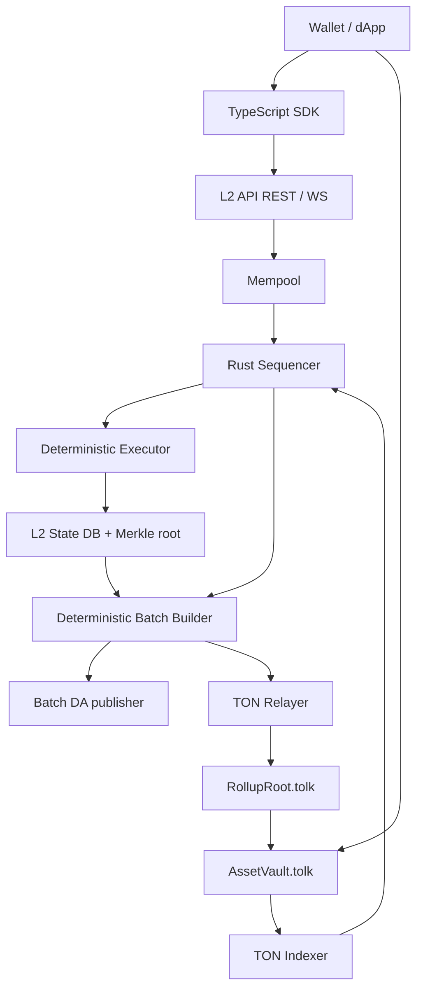

# Architecture

## Trust Model

This is an optimistic MVP. The sequencer commits batch roots to TON, and withdrawals
are claimable only after the challenge window. Fraud proofs are not implemented yet,
so production deployment must treat the sequencer as trusted until the fraud-proof
path or a ZK validity proof is added.

## Hashing

The MVP uses SHA-256 over domain-separated byte sequences. State leaves are sorted by
account id before Merkleization. Transaction, receipt, withdrawal, and block hashes
preserve canonical block order.

## Gas Coin

Asset id `0` is the L2-native gas coin. Deposits can credit any asset id, but all
non-system L2 transactions pay gas from asset id `0`.
