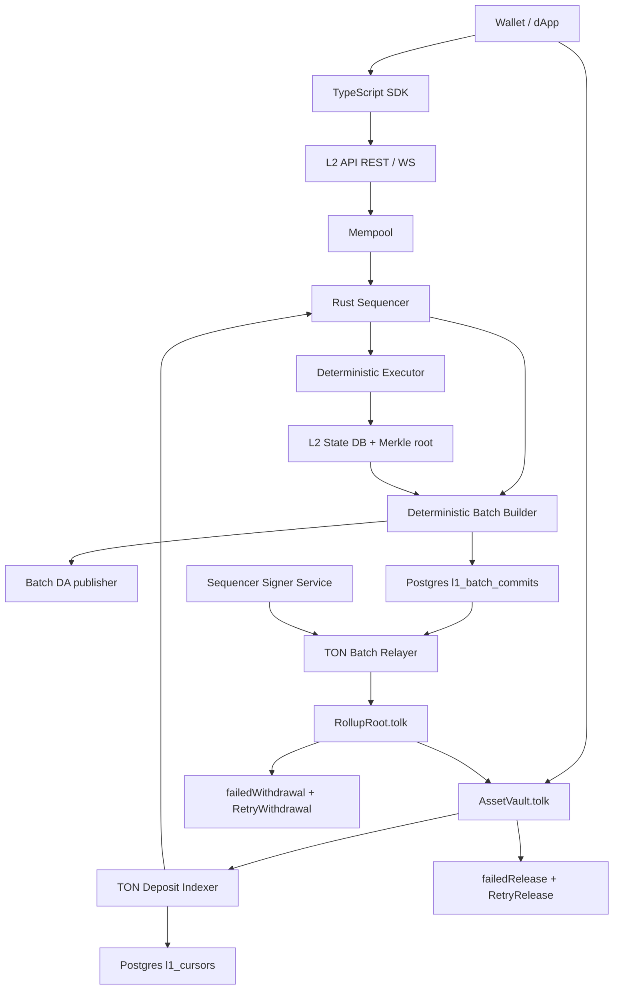

# Architecture

## Trust Model

This is an optimistic MVP. The sequencer commits batch roots to TON, and withdrawals
are claimable only after the challenge window. Fraud proofs are not implemented yet,
so production deployment must treat the sequencer as trusted until the fraud-proof
path or a ZK validity proof is added.

The fraud/challenge roadmap is documented in `docs/challenge-roadmap.md`. The
target model introduces observer/challenger nodes, DA challenges, invalid
transition challenges, challenge bonds, and forced inclusion without changing the
current bridge behavior until the L1 verifier is implemented.

## Hashing

The MVP uses SHA-256 over domain-separated v1 consensus bytes. JSON is allowed for
API and storage presentation, but not for transaction hashes, receipt leaves,
withdrawal leaves, account leaves, block headers, Merkle nodes, or batch data
commitments. The byte layout is documented in `docs/consensus-encoding.md`.

## Data Availability

Batch DA is a separate `l2-node` boundary, not part of sequencer execution. The
sequencer builds a block with `data_hash = hash(canonical_batch_data_bytes)`, then
the node writes those canonical bytes through `DaWriter` before the block is saved
as pending for L1 relay. Postgres remains the local mirror/cache. The MVP public
backend is a filesystem gateway that writes
`blocks/{height}/{block_hash}-{data_hash}.el2batch` and stores the relative
reference plus optional public URI with the Postgres mirror. The trait split
(`DaWriter`, `DaReader`, `DaVerifier`) is intentionally compatible with future TON
Storage or external DA providers.

The relayer calls `DaVerifier` before asking the signer service for a `CommitBatch`
BoC. Missing data, block-hash mismatch, data-hash mismatch, corrupted partial
payloads, unavailable filesystem payloads, or payloads above `DA_MAX_PAYLOAD_BYTES`
fail closed and do not reach the signer or Toncenter provider. Public payload
bytes are also available through `GET /v1/da/batch/{height}` and
`GET /v1/da/batch/{height}/{data_hash_hex}`. Operators can run the same
verification path through `GET /v1/operator/da/batch/{height}/{data_hash_hex}`,
which returns safe status, reason, latency, and public reference metadata without
serving the bytes. This MVP proves retrievability from the configured public
gateway; it does not yet prove availability from TON Storage.

## Gas Coin

Asset id `0` is the L2-native gas coin. Deposits can credit any asset id, but all
non-system L2 transactions pay gas from asset id `0`. The executor uses a
versioned gas schedule and charges `gas_used * max_gas_price` from that asset.
Rejected execution is no-refund for the MVP: an authenticated transaction that
reaches the executor advances nonce and may pay the smaller configured rejection
fee, while sequencer-level auth/nonce rejections remain uncharged.

## TVM Adapter Boundary

`CallContract` is routed through `TvmExecutionAdapter` in `l2-core`. The boundary
is synchronous and deterministic by design: it receives the target contract hash,
caller, decoded single-root input BoC, gas limit, explicit block context, and a
snapshot of the target contract account state. It returns gas used, applied or
rejected status, optional target-contract state delta, and emitted internal
messages.

The default adapter mode is `real`. It uses the official TON `tonlibjson` TVM
emulator through a runtime-loaded native library boundary instead of linking the
library at Rust build time. Operators may set `TVM_TONLIB_LIBRARY_PATH` to an
explicit `tonlibjson` shared library; otherwise the process searches the normal
platform library path. If the library is missing or an unsupported emulator
feature is hit, calls fail closed with `tvm_adapter_failed` or a stable TVM
receipt reason and still follow deterministic rejection-gas rules.

Read-only get-method execution uses the same contract code/data snapshot, but it
is routed through a separate `TvmGetMethodAdapter` path. Getter requests carry an
explicit method id, optional stack BoC, gas limit, and block context. The node
wraps real emulator getters in a bounded timeout, validates the returned stack BoC
and gas usage, and returns the result without writing the adapter output back to
state. This mirrors TON's off-chain getter model: a getter may inspect the current
account data and run TVM code, but it cannot change the committed L2 state root.

For local demo compatibility, `TVM_ADAPTER=prototype` keeps the old bounded
sample adapter. It recognizes only the sample L2 counter code hash, decodes a
Tolk-compatible `CounterIncrement` body, updates a deterministic sample storage
root, and returns `tvm_adapter_not_implemented` for all other code hashes. The
executor validates adapter output before applying it: malformed BoCs are
rejected before adapter entry, gas used must be in `1..=gas_limit`, internal
messages are capped by `max_internal_messages`, internal message bodies are
size-limited, and state deltas may only target the called contract.

## Internal Message Queue

TVM adapter output feeds a bounded async internal message queue. The queue is FIFO,
uses deterministic `message_id = hash_domain("l2.internal.message.id.v1", ...)`,
and delivers only messages that were pending at block start. Public and system
mempool transactions execute first; queued internal messages are then delivered up
to the remaining transaction capacity, `INTERNAL_QUEUE_MAX_PER_BLOCK`, and block
gas limit. Messages emitted while delivering another message are appended to the
tail and cannot recurse in the same block.

Each delivered message is represented in DA as a system `InternalMessage`
transaction with `from`, `to`, `body_boc_base64`, `bounce`, and `bounced` fields.
Public API submission rejects this transaction kind, so users cannot forge
contract-to-contract delivery through the mempool. Delivery failures for
bounceable messages schedule one bounced return message using the TON-style
`0xffffffff` bounced body prefix; bounced messages are never bounced again.
Non-zero internal value transfer is intentionally fail-closed until balance-moving
contract-to-contract sends are specified. `l2-node` persists the pending queue
snapshot after every saved block and restores the latest snapshot during startup,
so a normal restart does not drop scheduled internal deliveries.

## Contract State Storage

`DeployContract` carries `code_boc_base64` and `data_boc_base64`. The executor
decodes each BoC as a single-root TON cell, enforces separate code/data size
limits, derives `code_hash` and `data_hash` from the cell hashes, and rejects
malformed or oversized cells. A successful deploy writes those BoCs into the L2
account state and sets `storage_root` to the initial data cell hash.

`l2-node` persists contract cells separately from block JSON:

- `contract_code_cells`: `code_hash -> canonical code BoC`
- `contract_data_cells`: `data_hash -> canonical data BoC + storage_root`
- `contract_account_states`: `account_id -> latest contract account snapshot`

The public read endpoint is `GET /v1/contract/{id}/state`. It serves live
sequencer state when available and falls back to the persistent registry after a
node restart. Hash mismatches between account state and BoC registry are rejected
before persistence.

`POST /v1/contract/{id}/get-method` is the dApp read path. Built-in state getters
for the sample counter and EnWallet V5 R1 return typed JSON from the account
snapshot. Other methods require `TVM_ADAPTER=real` and return a stable
`vm_stack_boc` envelope with the raw TVM result stack. The endpoint is bounded by
configured getter gas, timeout, and stack-BoC limits and always includes the
state root observed before execution so clients can bind reads to an L2 state.

Storage-proof compatibility plan: the account leaf commits to
`code_hash`, `data_hash`, and `storage_root`; the registry binds those hashes to
canonical BoCs. Future account/storage proofs can therefore prove an account leaf,
then fetch or prove the code/data BoC by hash, and finally attach a cell/Merkle
proof for deeper contract storage without changing the existing state-root
fields.

## Deposit Indexing

TON deposits are observed through Toncenter v3 log messages from `AssetVault`.
The indexer filters by vault source, external-log destination, `DepositRecorded`
opcode, logical time cursor, and expected bridged TON asset id. Each valid event is
stored through the deposit table before it is handed to the sequencer, so replayed
`l1_tx_hash + lt` events are idempotent. Malformed expected logs do not advance the
cursor; temporary TON API failures are logged and do not block block production.

## L1 Deployment

The L1 pair uses a two-step root-to-vault link because TON addresses are derived
from `StateInit`. A root and vault cannot both include each other's final address
in initial data without a circular fixed point. Deployment therefore creates
`RollupRoot` with a zero-address vault sentinel, creates `AssetVault` with the
computed root address, then sends admin-only `SetAssetVault(vault)` to the root.
The link is one-time and must happen before any batch is committed.

## Batch Relaying

Each persisted L2 block creates a pending `l1_batch_commits` row. The relayer
maps block height `0` to RollupRoot batch number `1`, forms `BatchRootsA`
(`prevStateRoot`, `stateRoot`, `txRoot`) and `BatchRootsB` (`receiptRoot`,
`withdrawalRoot`, `dataHash`), verifies DA retrievability, asks the sequencer
signer service for a signed external message BoC, and sends that BoC to Toncenter
v3 `/message`. The node stores `pending`, `submitted`, `confirmed`, or `failed`
status per batch and uses bounded retries to avoid a retry storm during TON API,
signer, or DA backend failures.

The signer service is a separate process with typed action requests. The MVP
caller path supports `commit_batch`; the same schema reserves typed
deploy/finalize/claim/retry actions without exposing a raw-payload signing API.
The relayer rejects mismatched signer addresses, expired responses, and malformed
BoCs before Toncenter broadcast. See `docs/testnet-signer-service.md`.

## Fraud and Challenge Roadmap

Challenge support is a planned L1/L2 boundary. The current off-chain observer
prototype accepts RollupRoot-shaped commitments from an operator or future L1
getter client, fetches canonical DA payloads by `dataHash`, replays from a trusted
checkpoint, recomputes `txRoot`, `receiptRoot`, `withdrawalRoot`, and `stateRoot`,
and reports the first divergence. It stores observer checkpoints for bounded
future replays, but it does not submit on-chain challenges.

Missing DA is handled separately as an availability finding: no payload means the
batch cannot be independently replayed. Future L1 challenge logic should turn
that finding into a finalization block until the sequencer responds with data or
a backend-specific availability proof.

Future `RollupRoot` messages are expected to include `ChallengeBatch`,
`RespondChallenge`, `ResolveChallenge`, and `ForceInclude`. They are not active in
the MVP, and withdrawals remain trusted-sequencer optimistic until those messages
and their Tolk verifier are implemented.

## Withdrawal Bounce Recovery

`RollupRoot` marks a withdrawal claimed before sending `ReleaseAuthorized` to
`AssetVault`. If that root-to-vault message bounces, the claim remains marked and
the root stores a compact `ReleaseFailure` under `failedWithdrawal(withdrawalId)`.
Any actor can call `RetryWithdrawal(withdrawalId)`; retry uses only the stored
release fields, so the caller cannot change amount, recipient, or asset.

`AssetVault` stores `failedRelease(withdrawalId)` when an outbound release to the
recipient bounces, when the vault-owned Jetton wallet bounces, or when an
unsupported release asset is requested. For TON asset releases, recipient bounces
re-credit `lockedTon` before storing failure. For registered Jettons, the vault
routes TEP-74 transfers through the configured vault-owned Jetton wallet and
tracks pending query ids until `excesses` or bounce. Any actor can call
`RetryRelease(withdrawalId)` for stored retryable failures. Unsupported asset
failures remain visible and reject retry until the asset is registered or a
future wrapped-gas flow is implemented.
