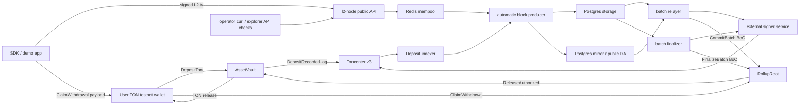

# Entropis Public Testnet Launch Runbook

This checklist is for a public TON testnet prototype rehearsal. It is not a
mainnet or production-readiness document. Keep all mnemonics, wallet exports,
API keys, database URLs, Redis URLs, admin tokens, signer tokens, and signed BoCs
in `.env.local`, local wallet tooling, or operator secret storage only.

## Scope

The launch goal is to connect the existing Entropis components end to end:

1. Deploy and verify `RollupRoot` and `AssetVault` on TON testnet.
2. Run Postgres, Redis, the external signer, and `l2-node`.
3. Enable the TON deposit indexer, block producer, batch relayer, and finalizer.
4. Demo faucet ENT, TON deposit, L2 transfer, L1 commit, finalization, and TON
   withdrawal claim.

The feature rollout order that leads into this launch checklist is tracked in
`docs/l2-rollout-order.md`. Do not treat later rollout phases such as staking,
full arbitrary TVM support, or Jetton hardening as required for the default TON
deposit/transfer/commit/finalize/withdraw demo unless that document is updated.

## Architecture



The sequencer is trusted in this MVP. Fraud proofs are not implemented on L1;
the observer/challenger prototype produces off-chain evidence for a manual L1
challenge/finality gate. Public filesystem DA proves retrievability from the
configured gateway, not censorship-resistant availability.

## Dependencies

- Linux, WSL, or Docker for Acton. The repo pins Acton `1.1.0` in `Acton.toml`.
- Rust stable toolchain with `cargo`.
- Node.js/npm for SDK examples and typecheck.
- Postgres and Redis reachable from the node process.
- Toncenter v3 testnet API access and TonAPI testnet access.
- A funded TON testnet deployer/admin wallet.
- A separate funded TON testnet sequencer signer wallet.
- An external signer service started from `cargo run -p l2-node --bin l2-signer`.
- Optional public DA filesystem gateway when `DA_PUBLIC_BACKEND=filesystem`.
- Optional explorer UI outside the tracked L2 tree. The launch path in this repo
  uses API and operator endpoint checks directly.

## Registry And Public Metadata

Runtime secrets and local deployment output stay untracked. Use
`docs/testnet-l1-deployment.md` to create ignored deployment output at
`build/testnet-l1-deployment.json`.

The public registry reference for docs and operator tooling is:

```text
deployments/testnet/entropis.json
```

The current guard policy treats `deployments/` as local artifact space. If the
registry is promoted to tracked source later, first update the artifact guard and
document the policy change. Until then, operators can serve a local copy
containing only public metadata:

- `rollupRoot` and `assetVault`
- deployed code hashes
- `deployedAt`
- deployer public address
- sequencer public address
- `challengeWindowSec`
- current RollupRoot bond status
- `tonAssetId` and decimals

Never put mnemonic phrases, private keys, signer tokens, API keys, database URLs,
Redis URLs, wallet exports, or signed BoCs in registry JSON.

## Non-Secret Environment Checklist

Start from `.env.example` and fill secrets only in `.env.local`. The following
values are safe to discuss in public when they contain public addresses or
placeholders:

| Variable | Testnet prototype value |
| --- | --- |
| `TON_NETWORK` | `testnet` |
| `TONCENTER_V3_BASE_URL` | `https://testnet.toncenter.com/api/v3` |
| `TONAPI_BASE_URL` | `https://testnet.tonapi.io` |
| `L2_CHAIN_ID` | `entropis-testnet` |
| `L2_NODE_ADDR` | public bind address or `127.0.0.1:8080` behind a proxy |
| `ENT_DECIMALS` | `9` |
| `ENT_FAUCET_REQUIRE_ADMIN` | `true` |
| `L2_DEV_ADMIN_DEPOSITS_ENABLED` | `false` for public testnet flows |
| `L2_CHALLENGE_WINDOW_SEC` | `300` unless the deployed root uses another value |
| `L1_VAULT_ADDRESS` | public `AssetVault` testnet address |
| `L1_ROLLUP_ROOT_ADDRESS` | public `RollupRoot` testnet address |
| `L1_SEQUENCER_SENDER_ADDRESS` | public sequencer signer wallet address |
| `L1_TON_ASSET_ID` | `1` for bridged TON |
| `L1_DEPOSIT_ASSET_IDS` | `1` until more assets are registered |
| `L1_DEPOSIT_INDEXER_ENABLED` | `true` after `AssetVault` is deployed |
| `L1_BATCH_RELAYER_ENABLED` | `true` after signer and `RollupRoot` are ready |
| `L1_BATCH_FINALIZER_ENABLED` | `true` after commit relaying is confirmed |
| `L1_COMMIT_SIGNER_ENDPOINT` | signer HTTP URL, usually private network/local |
| `L1_FINALIZE_SIGNER_ENDPOINT` | signer HTTP URL, usually private network/local |
| `DA_PUBLIC_BACKEND` | `filesystem` for public retrievability, `postgres` for local-only |
| `DA_PUBLIC_FS_DIR` | local directory served by the DA gateway |
| `DA_PUBLIC_BASE_URL` | public base URL for filesystem DA, if used |

Secret-only values must not appear in public docs, screenshots, logs, registry
files, or browser bundles:

- `TONCENTER_API_KEY`
- `TONAPI_KEY`
- `DATABASE_URL`
- `REDIS_URL`
- `L2_ADMIN_TOKEN`
- `L1_COMMIT_SIGNER_TOKEN`
- `L1_FINALIZE_SIGNER_TOKEN`
- `L2_SIGNER_TOKEN`
- `L2_SIGNER_COMMAND`
- any wallet, mnemonic, seed phrase, private key, or keyring export

## Pre-Launch Checks

Run these before using public testnet wallets:

```powershell
cargo fmt --all -- --check
cargo test --workspace
Set-Location sdk
npm ci
npm run typecheck
Set-Location ..
wsl bash scripts/ci/acton_contract_checks.sh
```

Then stage only the intended tracked files and run:

```powershell
python scripts/ci/secret_scan.py --staged
python scripts/ci/artifact_guard.py --staged
```

Acton validation must not run with `--net mainnet`. Testnet deployment uses the
explicit `l1-deploy-testnet` alias from `Acton.toml`; readback uses
`l1-verify-testnet` with `--fork-net testnet`.

## Launch Acceptance Matrix

Use this matrix as the go/no-go checklist. A public demo is not ready until every
`required` row is green and recorded in the local sign-off log.

| Area | Required evidence | Source |
| --- | --- | --- |
| L1 code | `acton build`, `acton test`, `acton check`, `acton fmt --check` pass | local command output |
| L1 deployment | Root and vault getter readback matches registry addresses, sequencer, challenge window, TON asset id, decimals, and unpaused state | `docs/testnet-l1-deployment.md` verify command |
| Runtime config | Node starts with `TON_NETWORK=testnet`; mainnet endpoints rejected; secrets only in `.env.local` | `/readyz`, config validation tests |
| Signer | Commit and finalize dry-runs return expected signer address and reject wrong-route actions | `docs/testnet-signer-service.md`, signer tests |
| Public API | `/healthz`, `/readyz`, explorer endpoints, account/tx/block reads, DA reads respond safely | curl/API checks |
| Admin API | Operator endpoints require bearer auth; admin token is not in browser bundles, registry, or logs | curl negative test |
| Demo flow | Faucet, TON deposit, L2 transfer, commit, finalization, withdrawal proof, and claim/release complete once | SDK example plus Tonviewer/Toncenter hashes |
| DA | Payload is retrievable by height and by `height + dataHash`; corrupted/missing DA is reported before signing | `/v1/da/batch/*`, relayer status |
| Observer | Replay of supplied commitments from DA succeeds or reports first divergence without local block JSON trust | `/v1/operator/observer/replay` |
| Security | Latest audit says no known open Critical/High issue for testnet prototype and challenge gate status is understood | `docs/security-audit-testnet-prototype-2026-06-04.md`, `RollupRoot.bondStatus()` |
| Evidence hygiene | Sign-off log contains only public addresses, hashes, heights, timestamps, and safe static reason codes | manual review |

## Clean Operator Rehearsal

Run this once from a fresh clone or clean worktree before public announcement.
The operator should not need private instructions outside `.env.local`, local
wallet tooling, and the ignored deployment output.

```powershell
git clone git@github.com:SoftwareMaestro16/L2-Layer.git L2-launch-rehearsal
Set-Location L2-launch-rehearsal
git status --short
Copy-Item .env.example .env.local
```

Fill `.env.local` from the non-secret checklist and local secret store. Do not
paste values into the runbook. Then run:

```powershell
cargo fmt --all -- --check
cargo test --workspace
Set-Location sdk
npm ci
npm run typecheck
npm run test:vectors
Set-Location ..
wsl bash scripts/ci/acton_contract_checks.sh
```

Deploy or verify L1 using the linked deployment runbook:

```bash
acton run l1-verify-testnet -- \
  <rollup-root-address> \
  <asset-vault-address> \
  <admin-address> \
  <sequencer-address> \
  <wrapped-gas-minter-address> \
  300 \
  1 \
  9
```

Start services in separate terminals and keep logs local:

```powershell
cargo run -p l2-node --bin l2-signer
cargo run -p l2-node
```

If Postgres, Redis, signer, and node are run by a process manager
instead of terminals, preserve the same start order and health checks. The clean
operator rehearsal is blocked, not failed, when funded testnet wallets,
`build/testnet-l1-deployment.json`, registry metadata, or provider API keys are
not available in the clean environment.

## Start Order

1. Confirm CI is green on the launch branch and the staged guards pass locally.
2. Start Postgres and Redis. Confirm the node can connect without logging secret
   URLs.
3. Build and test contracts through Acton.
4. Deploy `RollupRoot` and `AssetVault` with `docs/testnet-l1-deployment.md`.
5. Verify getters with `acton run l1-verify-testnet -- ...`.
6. Copy only public addresses and code hashes into the local registry copy.
7. Fill `.env.local` with testnet endpoints, public L1 addresses, and local
   secrets.
8. Start the signer service:

   ```powershell
   cargo run -p l2-node --bin l2-signer
   ```

9. Dry-run one typed `commit_batch` and one `finalize_batch` signer request
   without broadcasting, following `docs/testnet-signer-service.md`.
10. Start the node:

    ```powershell
    cargo run -p l2-node
    ```

11. Confirm:

    ```text
    GET /healthz
    GET /readyz
    GET /v1/operator/metrics
    GET /v1/operator/batch-relayer
    GET /v1/operator/batch-finalizer
    ```

    Operator endpoints require `Authorization: Bearer <L2_ADMIN_TOKEN>`.

12. Verify public explorer and operator status directly through API endpoints:

    ```text
    GET /v1/explorer/blocks
    GET /v1/explorer/txs
    GET /v1/operator/metrics
    ```

The block producer is spawned by `l2-node` and runs automatically. The deposit
indexer, relayer, and finalizer are enabled only by environment variables at node
startup.

## Public Demo Flow

Use SDK helpers from `sdk/README.md` and `sdk/examples/testnet-happy-path.ts`.

1. Create or import a demo L2 keypair and derive the account id with
   `accountIdFromKeyPair`.
2. Fund demo gas with the admin-only ENT faucet from an operator script or backend:

   ```text
   POST /v1/admin/faucet/ent
   Authorization: Bearer <L2_ADMIN_TOKEN>
   ```

   Do not put the admin token in browser code.

3. Build a TON deposit message with `depositTonTonConnectMessage`, send it from a
   TON testnet wallet to `AssetVault`, and wait for the indexer to record it.
4. Check deposit visibility:

   ```text
   GET /v1/explorer/deposits
   GET /v1/explorer/deposit/{deposit_id_hex}
   GET /v1/account/{account_id_hex}
   ```

5. Sign and submit an L2 transfer with `signTransferTransaction`:

   ```text
   POST /v1/tx
   GET /v1/tx/{tx_hash_hex}
   ```

6. Wait for automatic block production. Confirm the block and DA payload:

   ```text
   GET /v1/explorer/blocks
   GET /v1/da/batch/{height}
   ```

7. Wait for the relayer to submit and confirm `CommitBatch`:

   ```text
   GET /v1/explorer/summary
   GET /v1/operator/batch-relayer
   ```

8. Optional challenge rehearsal before finalization: stake a sequencer bond,
   open a challenge for the committed batch, confirm finalization is rejected
   while the challenge is open, then resolve the challenge from the admin wallet.
   Use `docs/testnet-l1-deployment.md` for exact Acton commands. Reject the
   rehearsal challenge before continuing the normal demo finalization path.

9. Wait at least `L2_CHALLENGE_WINDOW_SEC`, then confirm finalization:

   ```text
   GET /v1/operator/batch-finalizer
   GET /v1/explorer/withdrawal/{withdrawal_id_hex}
   ```

10. Build an L2 withdrawal with `signWithdrawTransaction`. After finalization,
   fetch the proof:

   ```text
   GET /v1/proof/withdrawal/{withdrawal_id_hex}
   ```

   A `409` response before finalization is expected.

11. Build the TON claim message with `claimWithdrawalTonConnectMessage`, submit
    it from a TON testnet wallet, and confirm the `AssetVault` release reaches
    the recipient.

Record this public-safe evidence for the demo flow:

| Step | Public-safe evidence |
| --- | --- |
| Registry | registry URL or local public path, root address, vault address, code hashes |
| Faucet | L2 account id, faucet deposit id, resulting ENT balance |
| TON deposit | Tonviewer testnet transaction URL, deposit id, L2 account credited amount |
| L2 transfer | tx hash, block height, receipt status |
| DA | block height, data hash, public DA URI or API response headers |
| Commit | batch number, RollupRoot commitment getter output, Tonviewer URL |
| Finalize | finalized batch number, finalizer status, Tonviewer URL |
| Withdraw | withdrawal id, proof API status, claim Tonviewer URL, vault locked TON delta |

Never include mnemonic phrases, private keys, bearer tokens, raw signed BoCs,
database URLs, Redis URLs, provider API keys, or full provider JSON responses.

## Endpoint Separation

Public endpoints:

- `GET /healthz`
- `GET /readyz`
- `POST /v1/tx`
- `GET /v1/tx/{hash}`
- `GET /v1/account/{id}`
- `GET /v1/block/{height}`
- `GET /v1/da/batch/{height}`
- `GET /v1/da/batch/{height}/{data_hash}`
- `GET /v1/explorer/summary`
- `GET /v1/explorer/blocks`
- `GET /v1/explorer/deposits`
- `GET /v1/explorer/deposit/{id}`
- `GET /v1/explorer/withdrawal/{id}`
- `GET /v1/proof/withdrawal/{id}`
- `WS /v1/stream`

Admin/operator endpoints:

- `POST /v1/admin/faucet/ent`
- `POST /v1/admin/deposit`
- `POST /v1/admin/produce-block`
- `GET /v1/mempool/metrics`
- `GET /v1/operator/metrics`
- `GET /v1/operator/failures`
- `GET /v1/operator/batch-relayer`
- `GET /v1/operator/batch-finalizer`
- `GET /v1/operator/observer/checkpoint`
- `POST /v1/operator/observer/replay`

Do not expose admin/operator endpoints without authenticated reverse proxy rules.
For public testnet demos, keep `L2_DEV_ADMIN_DEPOSITS_ENABLED=false`; use real
TON deposits through the indexer.

## Monitoring And Alerts

Suggested testnet alert thresholds:

- `/readyz.status != ready` for two consecutive polls.
- `node.block_production.errors` increases.
- No new `node.block_production.produced` for two block intervals while the
  mempool is non-empty.
- `queued_global` above 80% of `MEMPOOL_MAX_GLOBAL_QUEUE` for five minutes.
- `node.indexer.errors` increases for three consecutive polls.
- `node.relayer.failed` or `node.finalizer.failed` increases.
- Any failed batch or finalization appears in `GET /v1/operator/failures`.
- Pending relays remain older than two relayer poll intervals without submission.
- Pending finalizations remain unfinalized past `challengeWindowSec` plus two
  finalizer poll intervals.
- DA write latency or storage save latency exceeds 1000 ms.
- Signer returns `unauthorized`, `rate_limited`, `rollup_root_mismatch`,
  `signer_address_mismatch`, `expired_request`, or `malformed_boc`.
- Toncenter testnet readiness fails or send-message errors persist after retry
  backoff.
- Failed withdrawal records appear in the root or vault getters.

Log only heights, hashes, counters, public addresses, and static safe reason
codes. Do not log raw provider responses if they may contain API keys or signed
payloads.

## Stop, Rollback, And Emergency Actions

For a clean stop:

1. Stop public traffic at the reverse proxy or demo frontend.
2. Restart the node with `L1_BATCH_RELAYER_ENABLED=false` and
   `L1_BATCH_FINALIZER_ENABLED=false` if you need to stop new L1 broadcasts while
   keeping public reads online.
3. Stop `l2-node`.
4. Stop the signer service.
5. Stop Redis only after queued public submissions are no longer needed.
6. Stop Postgres last; preserve the database and DA files for audit.

For a bad deployment:

1. Stop relayer/finalizer/signing first so no additional signed BoCs are
   broadcast.
2. Preserve `build/testnet-l1-deployment.json`, node logs, DA payloads, and
   Postgres state locally.
3. Deploy a new root/vault pair, verify getters, and update the public registry
   copy by appending or replacing the active version according to the registry
   policy.
4. Restart signer and node with the new public addresses.

Emergency pause note: the current contracts store `paused` state and reject core
messages when paused, but this launch surface does not expose a tracked admin
pause operation. Treat emergency containment as an off-chain stop of public
traffic, relayer/finalizer, and signer until an explicit pause script/message is
added and tested.

Withdrawal retry procedures:

- If `RollupRoot.failedWithdrawal(withdrawalId)` exists, call
  `RetryWithdrawal(withdrawalId)` on `RollupRoot`.
- If `AssetVault.failedRelease(withdrawalId)` exists, call
  `RetryRelease(withdrawalId)` on `AssetVault`.
- Do not re-submit `ClaimWithdrawal` for a withdrawal already marked claimed by
  `RollupRoot`.

## Known Limitations

- Testnet only. The node rejects mainnet endpoints and this document does not
  imply mainnet readiness.
- Trusted sequencer. L1 fraud proofs are not implemented.
- The observer/challenger is off-chain evidence generation. RollupRoot can gate
  finality and account for testnet bond slashing, but `ResolveChallenge` is still
  admin/testnet controlled and not a mainnet-grade fraud proof verifier.
- Filesystem public DA is a gateway, not a decentralized DA layer.
- `CallContract` remains fail-closed until the real TVM adapter is integrated.
- ENT faucet is admin-only and intended for demos.
- Admin/operator endpoints rely on bearer auth and deployment topology.
- CORS is permissive for local browser tooling; keep admin tokens out of browser
  bundles and storage.
- Jetton bridge flows need separate public testnet asset hardening before they
  are part of the default launch demo.

## Final Launch Sign-Off

Before announcing a public demo, record locally:

- CI run URL and commit hash.
- `cargo fmt --all -- --check` result.
- `cargo test --workspace` result.
- SDK `npm ci` and `npm run typecheck` result.
- Acton `build`, `test`, `check`, and `fmt --check` result.
- Staged `secret_scan.py` and `artifact_guard.py` result.
- L1 deployment readback output with public addresses and code hashes.
- Manual testnet rehearsal notes for deposit, transfer, commit, finalization, and
  withdrawal.
- Explicit status for any blocked step. A blocked live rehearsal due to missing
  secrets, missing funded testnet wallets, or missing public registry is not a
  green launch result.

Keep this sign-off log free of secrets and raw signed BoCs.
